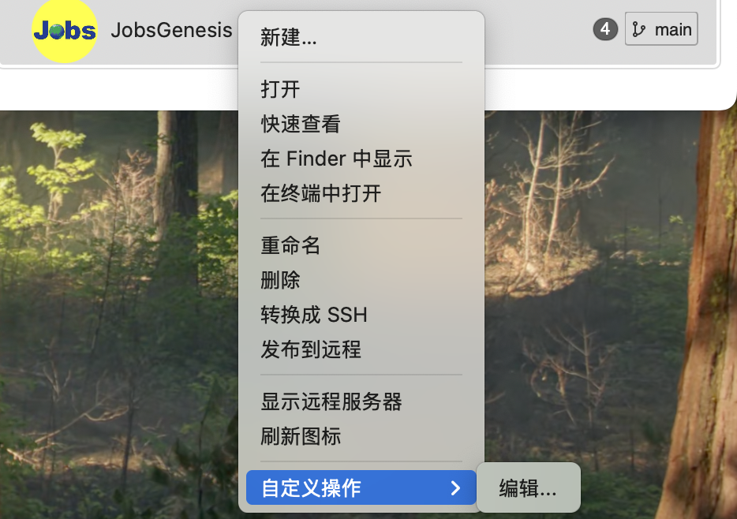

# 配置[**SourceTree**](https://www.sourcetreeapp.com/)脚本



* ⚠️ [**SourceTree**](https://www.sourcetreeapp.com/) 运行脚本的时候，**Shell**不会继承外部系统的**Shell**，从而丢失一些自定义配置。例：

  * 通过[**SourceTree**](https://www.sourcetreeapp.com/)运行下列脚本，打开的Shell并不是当前外部终端的Shell，可能丢失一些自定义配置

    ```shell
    #!/bin/zsh
    
    open -a "Visual Studio Code" "$1"
    ```

  * 通过[**SourceTree**](https://www.sourcetreeapp.com/)运行此脚本，打开的Shell注入了一些自定义配置，但还没有完全继承外部的Shell

    ```shell
    #!/bin/zsh
    
    # 用SourceTree运行此脚本，不会继承当前的Shell。需要做一些额外的操作
    cd "${1:-$PWD}" || exit 1         # 切换操作执行目录为（外来参数：当前目录）
    
    rm -f ~/.jenv/shims/.jenv-shim    # 删除 jenv 构建不成功的中间件
    eval "$(jenv init -)"
    jenv local openjdk64-17.0.16      # 用 jenv 仅对本次进程切到 JDK 17
    jenv rehash                       # 使得上面配置的 jenv 生效
    jenv shell openjdk64-17.0.16;     # 当前终端使用 JDK 17
    
    exec code -n .                    # 用VSCode打开项目
    ```

